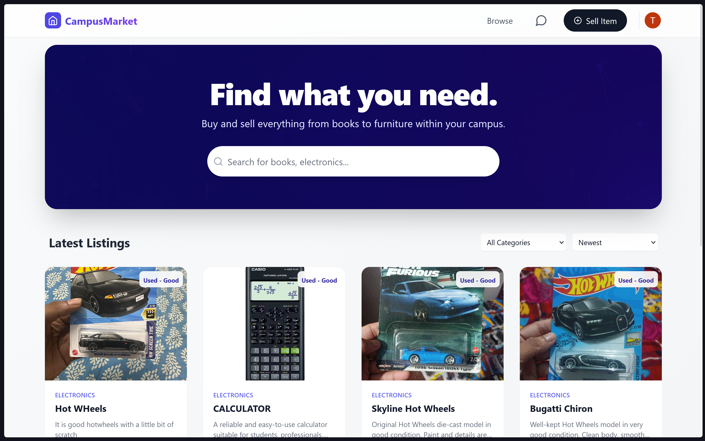
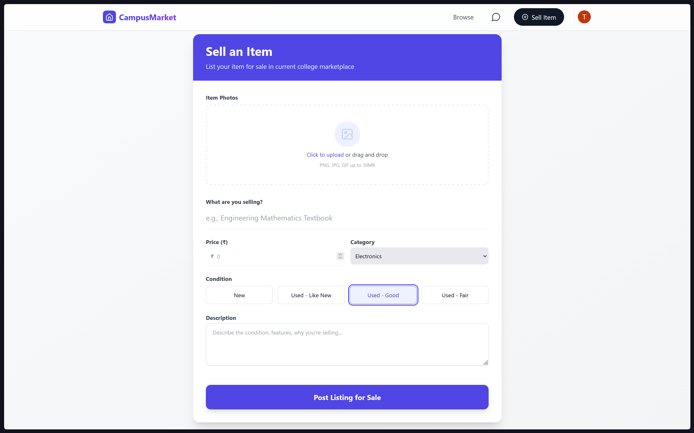
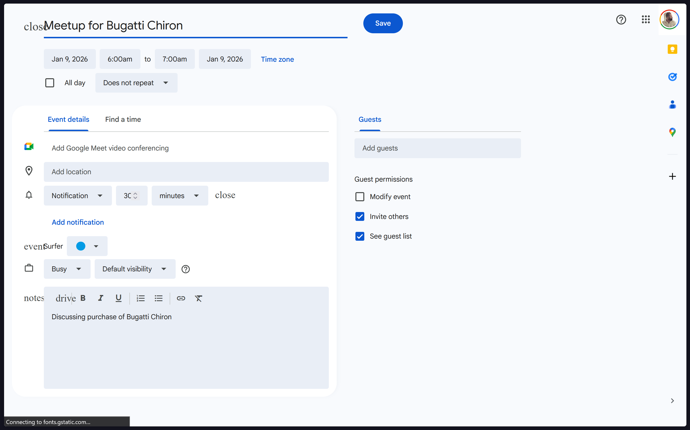

# 🎓 CampusMarket

> A secure, college-exclusive marketplace for students to buy, sell, and connect.

🚀 **Live Demo:** https://team-chanchal.vercel.app/

## 🌟 Overview
**CampusMarket** reduces the friction of buying and selling items on campus. Unlike open platforms like OLX, this marketplace is **restricted strictly to our college domain (`@vjcet.org`)**, creating a verified and safe environment for students.

Built with the **MERN Stack** and powered by **Google Cloud Platform**, it features real-time-like messaging, smart meet-up scheduling, and a modern glassmorphism UI.

## ✨ Key Features
* 🔒 Exclusive Access: Authentication locked to `vjcet.org` via Firebase Auth
* 💬 Integrated Chat
* 🔔 Smart Notifications
* 📅 One-Click Meetups (Google Calendar)
* 📸 Media Rich Uploads
* 📱 Mobile First Design

## 📸 Screenshots

### 🔐 Login Page

### 🏠 Home / Listings Page

### ➕ Sell Item Page

### 💬 Chat & Meetup Scheduling

### 📅 Google Calendar Meetup Integration

## 🤝 Contributing

Built by **Team Chanchal** for the Hackathon.
